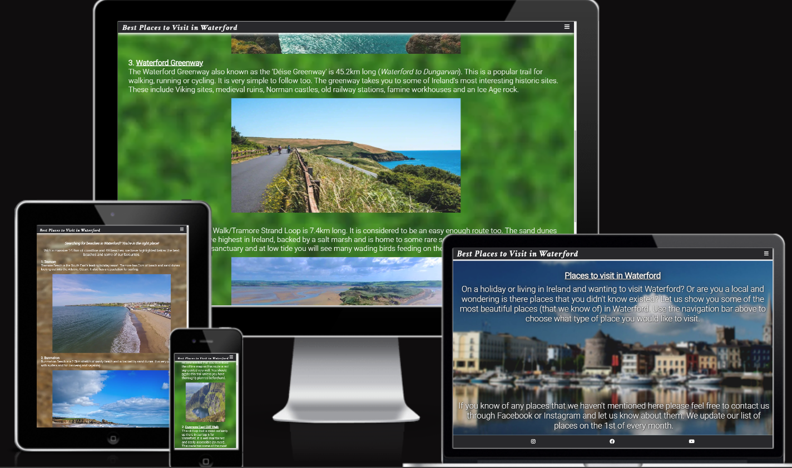
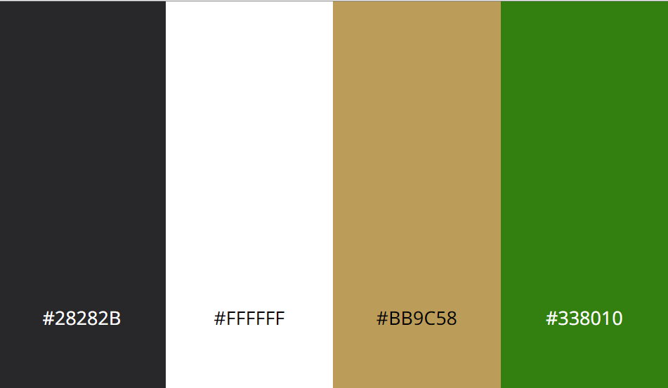

# Best Places to Visit in Waterford

My Best Places to Visit in Waterford website is designed to allow it's visitors
to find new (or old places they may have forgotton about) places in Waterford,  
whether it be the beach or somewhere nice to go for a walk they can find that  
information here. My website is also responsive so the visitor can view it from
whatever device they choose.

[View Best Places to Visit in Waterford on GitHub](https://github.com/AnneEnglish/Portfolio-1)

---

## Contents

- [User Experience](#User-Experience)

  - [Initial Discussion](#Initial-Discussion)
  - [User Stories](#User-Stories)

- [Design](#design)

  - [Colour Scheme](#colour-scheme)
  - [Typography](#typography)

- [Technologies Used](#technologies-used)

  - T

- [Deployment and Local Development](#deployment-and-local-development)

  - Dev

- [Testing](#testing)

  - Testing

- [Credits](#credits)
  - Code

---

## User Experience

### Initial Discussion

Best Places to Visit in Waterford is a website where people can gather information
and ideas on places to visit within Waterford. They can choose from different places
by using the navigation bar. If they visit any of the places we have recommended
they can tag us on our Facebook or instagram pages. That way we can gauge what
kind of places are more popular than others, in return we can tailor our website
to suit our users and what they like. If they also have any suggestions they can
contact us through our social media.

### User Stories

#### First Time Visitor Goals

- I want to be able to understand the purpose of the site.
- I want to be easily able to navigate through the website.
- I want to be intrigued and continue browsing through the website.
- I want to able to locate their social media and see past places that they have recommended. I also want to see vlogs they have posted on their Youtube.

#### Returning Visitor Goals

- I want to find new recommendations for the month.
- I want to be able to find out how to contact them with any suggestions I have or any questions I have.

#### Frequent Vistor Goals

- I want to be able to contact them with suggestions and submit my own photos for them to use on their website if they would like to.

#### Client Goals

- To be able to view the site on a range of devices with no issues.
- To make it clear to visitors what the purpose of the site is for.
- To allow visitors to submit suggestions if they would like to.

## Design

### Colour Scheme

This website uses an earthy colour palette. The colour palette **image** was created using [Art in Context](https://artincontext.org/color-palette-generator/). The colours were chosen by me for
the website, not by using a colour palette generator.

### Typography

Google Fonts was used for all the fonts on the website.
The following fonts were used on the website:

- The header on the page is 'Crimson Text (Bold 700 Italic)', which is a serif font.
- The body area, _including any 'h' elements_ is 'Roboto (Light 300)', which is a sans-serif font.

### Imagery

Images used on this site are from Shutterstock or Adobestock (I own account with them and I am signed up for a free trial with them.) The background images for beaches.html and trails.html are from google images. I have also credited these in the credit section with a link to the images.

### Features

This website contains three pages (home page, beaches, trails), all of which are accessible from the navigation bar.

- All pages on the website contain the following:

  - A responsive navigation bar at the top right of the screen which allows the user to navigate easily through the site. This navigation bar has a burger icon to toggle it.
  - A footer which contains three icons (Instagram, Facebook, Youtube) to allow the user to access our social media or contact us whenever they wish to. I used those icons as they are universally recognised and it help to keep the footer looking clean.

## Technologies Used

## Deployment and Local Development

## Testing

## Credits
